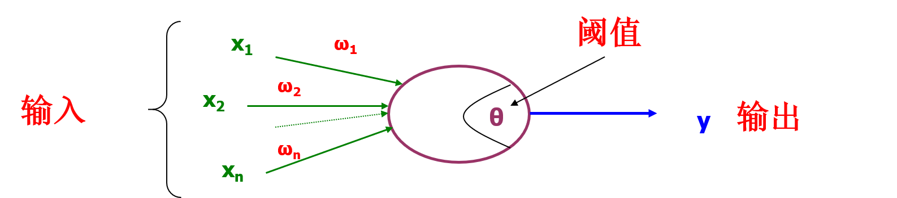
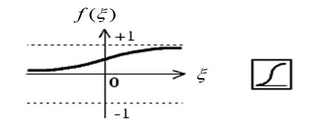
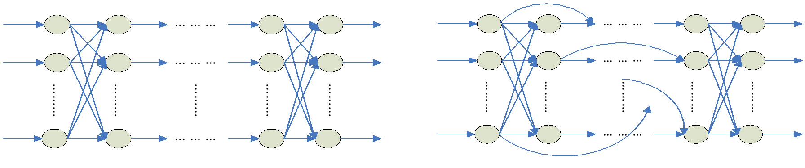

联结主义学派
----------

什么是神经网络
------------

所谓的 __人工神经网络__ (artificial neural networks, ANNs) 就是基于模仿生物大脑的结构和功能而构成的一种信息处理系统。

#### M-P 模型（简单的人工神经元模型）####

现在神经网络的理论准备可追溯到20世纪40年代。1943年，McCulloch 和 Pitts 发表了关于神经网络的模型，以他们的名字首字母命名为 M-P 模型。下面是该模型（人工神经元）的示意图。

{: width="100%"}

其中，\$$y = f(\xi) = f(g(X))$$

$$f$$ 为激活函数 (Activation Function)

$$g$$ 为组合函数 (Combination Function)

$$\xi = g(X) = X^TW - \theta$$

$$y = f(\xi) = f(X^TW - \theta) = f(X'^TW')$$

其中，$$X, W$$ 为 $$n$$ 维列向量；$$X' = (X^T, 1)^T, W' = (W^T, -\theta)^T$$。

##### 径向距离 (Radial Distance) #####

$$\xi = \|X - C\| = \sqrt{(X-C)^T(X-C)}$$

$$y = f(\xi) = f(\sqrt{(X-C)^T(X-C)})$$

##### 激活函数 #####
常用的非线性激活函数，例如：Logistic Sigmoid 函数\$$f(\xi) = \frac{1}{1 + e^{-\alpha\xi}}$$

Sigmoid 函数变化曲线如下：

{: width="100%"}

##### 人工神经网络 #####
* 多个人工神经元按照特定的网络结构联接在一起，就构成一个人工神经网络；
* 神经网络的目标就是将输入转变成有意义的输出。

### ANN 的结构 ###
* 前馈结构 (Feedforward Architecture)
	- 不会出现循环
	- 静态

{: width="100%"}

* 反馈/循环结构 (Feedback/Recurrent Architecture)
	- 出现循环
	- 动态

{: width="100%"}

### ANN 的学习方法 ###

通过神经网络所在环境的模拟过程，调整网络中的自由参数。

##### 学习策略：赫布型学习 (Hebbrian Learning) #####
* 若两端的神经元同时激活，增强联结权重
* 非监督型

$$w_{ij}(t + 1) = w_{ij}(t) + \eta(x_i(t)\cdot x_j(t))$$

其中，$$\eta$$ 为学习速率（一个可选的合适的常系数）

##### 学习策略：错误更正型学习 (Error Correction) #####
* 最小化实际输出与期望输出之间的误差
	- Delta Rule (LMS Rule, Widrow-Hoff)
	- B-P Learning
* 监督型

目标：$$\omega^* = arg \min\limits_\omega\frac{1}{K}\sum\limits_{k = 1}^K e(D_k, Y_k)$$

求解：$$\omega \leftarrow \omega + \Delta\omega = \omega + \eta\delta$$

##### 学习策略：Stochastic Learning #####
* 采用随机模式，跳出局部极小
	- 如果网络性能提高，新参数被接受
	- 否则，新参数依概率接受

##### 学习策略：Competitive Learning #####
* 胜者为王
* 非监督

### 重要的人工神经网络模型 ###

### 自组织网络 ###
