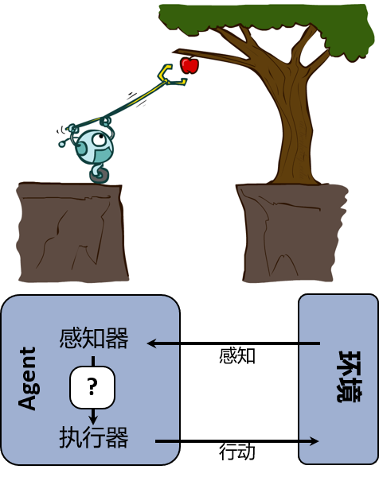
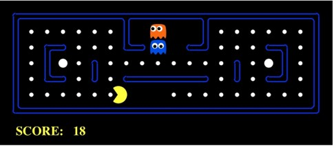

Agent 与环境
----------

__Agent__ 可以通过 __传感器__ (sensors) 来感知 __环境__ (environment)，然后通过 __执行器__ (actuators) 来作用环境。

{: width="100%"}

简而言之，Agent 就是能够<mark>感知环境并作出行动的存在物</mark>，如上图 _摘苹果的小机器_ 。

良好行动：理性的概念
---------------
__理性 Agent__ (rational agent) 就是能做出良好行动的 Agent。

>然而，什么是良好行动呢？

所谓良好行动是指 Agent 对环境作出的行动是所期望的。而实际行动与所期望的行动之间需要用一个 __绩效指标__ (performance measure) 来衡量（一般地，实际行动达到预期则增加绩效值），而理性 Agent 就是对每一种可能的感知序列都应该做出行动来要使绩效最大化。

### 理性 (Rationality) ###
__理性__ 依赖于以下四个因素：

1. __绩效指标__ : The performance measure that defines the criterion of success.
2. __先验知识__ : The agent's prior knowledge of the environment. 
3. __可能行动__ : The actions that agent can perform.
4. __当前感知__ : The agent's percept sequence to date.

例如下图的 _吃豆人_ (pac-man) 游戏。

{: width="100%"}

* 绩效指标：每到达一个有豆子的地方，则加 1 分，并限制在 30 步内；
* 先验知识：地图（不包含豆子）；
* 可能行动：上、下、左、右；
* 当前感知：正确地感知到当前所处位置是否有豆子。

在上述描述的环境下，吃豆人的目标是使得到分数尽可能高，则称吃豆人为理性 Agent 或 智能 Agent。

Agent 的结构
----------

__Agent 函数__ 是 _感知_ 到 _行动_ 的一个映射\$$f: P^*\to A$$ 实现人工智能的一个工作就是设计 __Agent 程序__ 来实现 __Agent 函数__ 的功能。 __软件结构__ (architecture) 是一系列用来执行 __Agent 程序__ 的设备（如：感知器、执行器）。

换言之，\$$ Agent = 软件结构 + 程序 $$

### Agent 程序 ###

下面是通过查表来实现的 Agent 程序：

```python
def TABLE_DRVIEN_AGENT(percept):
    # 感知序列，初始置空
    global percepts = []
    # 感知序列与对应行动的记录表格
    global table = init()
    percepts.append(percept)
    # 从表格中找到当前感知序列对应的行动
    action = table[percepts]
    return action
```

### 简单反射的 Agent ###

最简单的一类 Agent 就是简单反射 (simple reflex) 的 Agent，这类 Agent 只关心当前的感知，而忽略以前的感知。

```python
def SIMPLE_REFLEX_AGENT(percept):
    global rules
    # 解释当前感知对应的状态
    state  = INTERPRET_INPUT(percept)
    # 从规则集中找到当前状态的应对规则
    rule   = rules[state]
    # 得到该规则对应的行动
    action = rule.action
    return action
```

### 基于模型反射的 Agent ###

```python
def MODEL_BASED_REFLEX_AGENT(percept):
    global state, action, rules, model
    # 从上一次状态和行动，并结合当前的感知和模型来更新当前状态
    state  = UPDATE_STATE(state, action, percept, model) 
    rule   = rules[state]
    action = rule.action
    return action
```

### 基于目标的 Agent ###

通常，这类 Agent 程序是用来解决 _搜索_ 和 _规划_ 的问题。

### 基于效用的 Agent ###

### 学习型 Agent ###

### 组织 Agent 程序协同运作 ###
