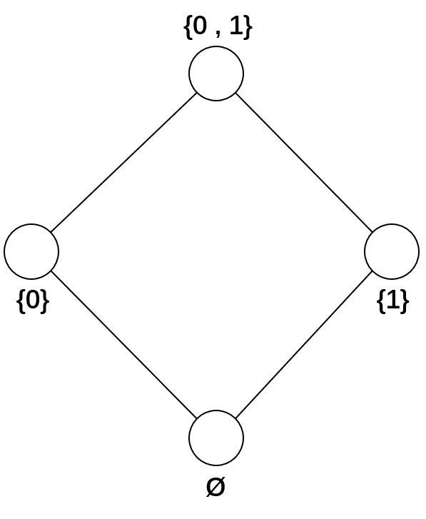
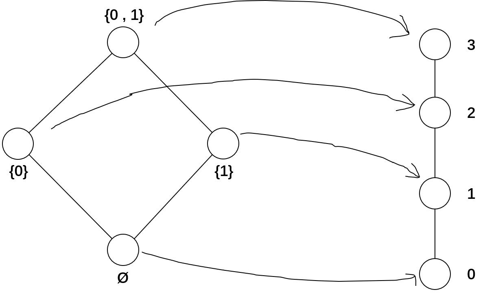
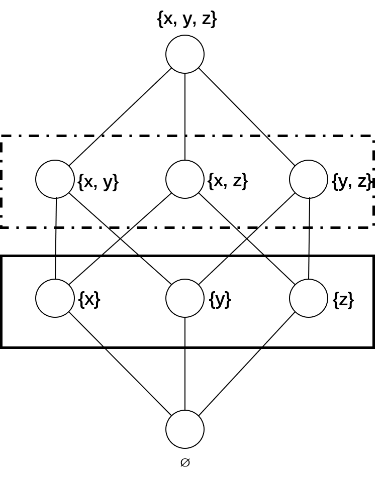

# $$\bowtie$$ 偏序集 $$\bowtie$$
## 二元关系

两个集合 $$M , N$$ 上的 二元关系 $$R$$，即 $$M\times N$$ 的子集。
> 如果 $$ N = M $$，则称为 **集合 $$M$$ 上的关系 $$R$$**

$$(m, n) \in R$$

也可以写为

$$m R n$$

$$R^{-1}$$ 称为 $$R$$ 的逆关系

$$n R^{-1} m :\Leftrightarrow m R n$$

## 偏序关系

集合 $$M$$ 上的关系 $$R$$ ，如果对于所有元素 $$x, y, z \in M$$ 满足以下条件：

i. **自反性**

$$x R x$$

ii. **反对称性**

$$x R y \wedge x \neq y \Rightarrow \neg y R x$$

iii. **传递性**

$$x R y \wedge y R z \Rightarrow x R z$$

偏序关系 $$R$$ 记为 $$\leq$$，而 $$R^{-1}$$ 则记为 $$\geq$$。

$$x < y :\Leftrightarrow x \leq y \wedge x \neq y$$

偏序集写作 $$(M, \leq)$$，其中 $$\leq$$ 为 $$M$$ 上的偏序关系。

## 近邻

如果 $$a < b$$ 且不存在 $$c$$ 满足 $$a < c < b$$，则称 $$a$$ 为 $$b$$ 的**下近邻**，写作 $$a \prec b$$。而称 $$b$$ 为 $$a$$ 的**上近邻**。

> **Hesse 图表示偏序集 $$(M, \leq)$$.** $$M$$ 中的元素在 Hesse 图中用 **小圆圈** 表示。如果 $$x, y\in M$$ 且 $$x \prec y$$，则 $$y$$ 的圆圈在 $$x$$ 的圆圈之上。

{: width="66%"}

以上 Hesse 图表示 $$\{0, 1\}$$ 的幂集，其中偏序关系为集合的 **包含于**

即偏序集 $$(\mathcal{P}(\{0, 1\}), \subseteq)$$ 的 Hesse 图。

## 可比、链、宽度和长度
1. 如果 $$(M, \leq)$$ 的两个元素 $$x, y$$ 有 $$x \leq y$$ 或 $$y \leq x$$ 成立，则称 $$x, y$$ 是可比的，否则称为不可比的；
2. 如果 $$(M, \leq)$$ 的子集 $$(N, \leq)$$ 中的任意两个元素是可比的，则该子集称为链；如果任意两个元素都是不可比的，则该子集称为反链。
3. 有限偏序集的宽度定义为其最大反链的大小，一般的偏序集 (包括无穷的情况) 的宽度定义为其所有反链大小的上确界；类似地，长度定义为其所有链的大小上确界减 1 。

{: width="66%"}

以上图为例，$$\{0, 1\}$$ 和 $$\{0\}$$ 是可比的，$$\{0\}$$ 和 $$\{1\}$$ 是不可比的；实线方框覆盖的集合是链，虚线方框覆盖的集合是反链；根据定义，该偏序集的宽度为 2，长度为 2。

## 区间、主理想和主滤子
$$a, b, c, d$$ 是偏序集 $$(M, \leq)$$ 的元素，其中 $$b\leq c$$
1. $$[b, c] := \{x\in M \mid b\leq x\leq c\}$$ 称为 **区间**；
2. $$(a] := \{x\in M\mid x\leq a\}$$ 称为 **主理想**；
3. $$[d) := \{x\in M\mid d\leq x\}$$ 称为 **主滤子**。

## 保序、序嵌入和序同构
给定两个偏序集 $$(M, \leq)$$ 和 $$(N, \leq)$$ ，定义映射 $$\phi: M \to N$$。
1. 如果 $$\forall x, y \in M$$ 都有 $$x \leq y \Rightarrow \phi(x)\leq\phi(y)$$，则称 $$\phi$$ 是保序的；
2. 如果 $$\forall x, y \in M$$ 都有 $$x \leq y \Leftrightarrow \phi(x)\leq\phi(y)$$，则称 $$\phi$$ 是序嵌入的；
3. 如果 $$\phi$$ 是序嵌入，且满足双射，则 $$\phi$$ 是序同构的。

**注意，双射的保序映射不一定是序同构映射，例如下图。**

{:width="100%"}

## 直接积

给定两个偏序集 $$(M_1, \leq)$$ 和 $$(M_2, \leq)$$，定义偏序集 $$(M_1 \times M_2, \leq)$$，这里 $$M_1 \times M_2$$ 的 $$\leq$$ 定义如下：

$$(x_1, x_2) \leq (y_1, y_2) :\Leftrightarrow x_1\leq y_1 \wedge x_2\leq y_2,$$

$$x_1, y_1 \in M_1, x_2, y_2 \in M_2$$

将该定义推广到多个偏序集：如果 $$T$$ 是一个索引集，而且 $$(M_t, \leq)$$ 是偏序集 $$(t\in T)$$，则 

$$\underset{t\in T}{\times} (M_t, \leq) := (\underset{t\in T}{\times} M_t, \leq)$$

那么

$$(x_t)_{t\in T} \leq (y_t)_{t\in T} : \Leftrightarrow \forall t\in T. x_t \leq y_t$$

## 基本和 (不相交并)

引入符号

$$\dot{M}_t := \{t\}\times M_t$$

定义

$$(M_1, \leq) + (M_2, \leq) := (\dot{M}_1\cup\dot{M}_2, \leq)$$

其中

$$(s, a) \leq (t, b) :\Leftrightarrow s = t \wedge a \leq b$$

该定义也可以推广到多偏序集的情形。

## 对偶原理

对偶符号 

$$\leq, \geq$$

$$\vee, \wedge$$

$$\bigvee, \bigwedge$$

$$0_V, 1_V$$

将命题中出现的以上符号替换成其对偶符号后得到的命题，称其为该命题的对偶命题。

>对于互相对偶的命题，只证明其中一个即可，另一个根据对偶原理成立。

## 下界、上界、下确界 (交)、上确界 (并)
给定偏序集 $$(M, \leq)$$，其中 $$A \subseteq M$$.

### 下界、上界
$$s \in M$$. 满足 $$\forall a \in A. s \leq a$$，则 $$s$$ 为 $$A$$ 的下界；对偶地，得到上界的定义。

### 下确界、上确界
$$A$$ 的下确界 

$$\inf{A} := \max{\{s \in M\mid\forall a\in A. a\leq s\}}$$ 

或记为 $$\bigwedge A$$ (亦称为 $$A$$ 的交)；

对偶地，$$A$$ 的上确界 

$$\sup{A}:= \min{\{s \in M\mid\forall a\in A. a\geq s\}}$$

或记为 $$\bigvee A$$ (亦称为 $$A$$ 的并)。

# $$\lozenge$$ 完全格 $$\lozenge$$

## 格、完全格、单位元、零元

1. 如果偏序集 **V** := $$(V, \leq)$$ 中任意两个元素存在上确界和下确界，则称其为格；
2. 如果 $$V$$ 的所有子集 $$X$$ 存在上确界和下确界，则称其为完全格；
3. 格 **V** 的最大元素称为单位元，记为 $$1_V$$；最小元素称为零元，记为 $$0_V$$。

> 特别约定， $$\varnothing$$ 的下确界为 $$1_V$$，上确界为 $$0_V$$，即 $$\bigwedge\varnothing = 1_V, \bigvee\varnothing = 0_V$$ 。
>
> (注意，这里 $$\varnothing$$ 不是偏序集的元素)

显然，所有非空有限格都是完全格。

> **给定偏序集 $$(M, \leq)$$，其每个子集的下确界都存在，则它是完全格。**
>
> **证明：** 设 $$X$$ 是该偏序集的任意子集。往证 $$X$$ 存在上确界。
>
> 设 $$X$$ 的所有上界构成的集合为 $$S$$，显然 $$S$$ 是 $$M$$ 的子集。
>
> 由题设可知， $$S$$ 存在下确界 $$s$$。
>
> 因为 $$\forall x\in X, x \leq s$$ 且 $$\forall y\in S, s \leq y$$，
>
> 所以 $$X$$ 存在上确界 $$s$$
>
> 证毕。

# 几个格的例子
1. 对于有限集合 $$M$$，$$(\mathcal{P}(M), \subseteq)$$ 是完全格；
2. 对于实数区间 $$[a, b]$$，$$([a, b], \leq)$$ 是完全格；
3. $$(\mathbb{R}, \leq)$$ 是格，但不是完全的，因为$$\mathbb{R}$$上没有最大元素，也没有最小元素。

## $$\bigvee$$-不可约[^1]、$$\bigwedge$$-不可约[^2]

给定完全格 **V** 中的元素 $$v$$，定义

$$v_* := \bigvee\{x\in V\mid x < v\}$$

$$v^* := \bigwedge\{x\in V\mid v < x\}$$

1. 如果 $$v \neq v_*$$，则称 $$v$$ 是 $$\bigvee$$-不可约的；
2. 如果 $$v \neq v^*$$，则称 $$v$$ 是 $$\bigwedge$$-不可约的。

> **有限格的一个元素 $$v$$ 是 $$\bigvee$$-不可约的 $$\Leftrightarrow$$ 它有且仅有一个下近邻。**
>
> **证明：**
>
> $$v$$ 是$$\bigvee$$-不可约的，即 $$v \neq v_*$$
>
> $$\Leftrightarrow$$ $$v_*$$ 是小于 $$v$$ 的最大元素
>
> $$\Leftrightarrow$$ $$v_*$$ 是 $$v$$ 的唯一下近邻
>
> 证毕。

根据对偶原理，以上命题的对偶命题也成立。

## 上确界稠密 (并稠密)、下确界稠密 (交稠密)

设 $$X \subseteq V$$，

如果

$$\forall v \in V, v = \bigvee\{x\in X\mid x\leq v\}$$

则称 $$X$$ 是关于 $$V$$ 上确界稠密的。

显然，**V** 的每一个上确界稠密子集 $$X$$ 包含了 **V** 的所有 $$\bigvee$$-不可约的元素；

如果

$$\forall v \in V, v = \bigwedge\{x\in X\mid v\leq x\}$$

则称 $$X$$ 是关于 $$V$$ 下确界稠密的。

显然，**V** 的每一个下确界稠密子集 $$X$$ 包含了 **V** 的所有 $$\bigwedge$$-不可约的元素。

记号 $$J$$(**V**) 表示 **V** 中所有 $$\bigvee$$-不可约的 元素构成的集合；

记号 $$M$$(**V**) 表示 **V** 中所有 $$\bigwedge$$-不可约的 元素构成的集合。

> 有限格 **V**，集合 $$J$$(**V**) 是上确界稠密的，集合 $$M$$(**V**)是下确界稠密的。
>
> **证明：** 显然，$$\forall v \in J(V), v = \bigvee\{x\in J(V)\mid x\leq v\}$$
>
> 考虑 $$\forall v \in V\setminus J(V)$$，往证 $$v = \bigvee\{x\in J(V)\mid x\leq v\}$$
>
> 因为 $$v\in V\setminus J(V)$$，所以 $$v$$ 不是 $$\bigvee$$-不可约的，即 $$v = v_*$$
> (待续)

## 原子、反原子、原子态

1. 零元的上近邻，称为原子；
2. 单位元的下近邻，称为反原子；
3. 完全格的所有元素都可以由其原子某种组合的并得到，则称其是原子态的。

{:width="66%"}

上图实线方框内的元素是原子，虚线方框内的元素是反原子，并且该完全格是原子态的。

<!-- 
## 上确界子半格、下确界子半格、完全子格

## 保上确界、完全格同态 -->

<!-- # 闭包算子

# 伽罗瓦连接

定义两个偏序集$$(P, \leq)$$ 和 $$(Q, \leq)$$ 上的映射 $$\phi$$ 和 $$\psi$$。

$$\phi : P \to Q$$ 和 $$\psi: Q \to P$$

如果满足
1. $$p_1 \leq p_2 \Rightarrow \phi p_1 \geq \phi p_2$$
2. $$q_1 \leq q_2 \Rightarrow \psi q_1 \geq \psi q_2$$
3. $$p \leq\psi\phi p$$ 和 $$q \leq\phi\psi q$$

则此映射对 $$(\phi, \psi)$$ 称为伽罗瓦连接。或称这两个映射互为对偶伴随。 -->

*[偏序集]: ordered sets, partially ordered sets
^
*[二元关系]: binary relation
^
*[逆关系]: inverse relation
^
*[偏序关系]: order relation
^
*[Hesse 图]: Hesse diagram, line diagram
^
*[近邻]: neighbour
^
*[下近邻]: lower neighbour
^
*[上近邻]: upper neighbour
^
*[可比]: comparable
^
*[不可比]: incomparable
^
*[链]: chain
^
*[反链]: antichain
^
*[宽度]: width
^
*[长度]: length
^
*[区间]: interval
^
*[主理想]: principal ideal
^
*[主滤子]: principal filter
^
*[保序]: order-preserving
^
*[序嵌入]: order-embedding
^
*[序同构]: (order-) isomorphism
^
*[直接积]: (direct) product
^
*[基本和]: cardinal sum
^
*[不相交并]: disjoint union
^
*[对偶原理]: The Duality Principle
^
*[下界]: lower bound
^
*[下确界]: infimum
^
*[交]: meet
^
*[上界]: upper bound
^
*[上确界]: supremum
^
*[并]: join
^
*[格]: lattice
^
*[完全格]: complete lattices
^
*[单位元]: unit element
^
*[零元]: zero element
^
*[上确界稠密]: supremum-dense
^
*[并稠密]: join-dense
^
*[下确界稠密]: infimum-dense
^
*[交稠密]: meet-dense
^
*[原子]: atoms
^
*[反原子]: coatoms
^
*[原子态]: atomistic

<!-- *[伽罗瓦连接]: Galois connection

*[对偶伴随]: dually adjoint -->

# 结语

详细内容可参考[^3]

[^1]: 读作“上确界不可约”, supermum-irreducible
[^2]: 读作“下确界不可约”, infimum-irreducible
[^3]: Ganter B, Wille R. Formal concept analysis: mathematical foundations